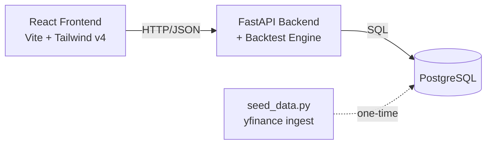

# Qode Backtester — Equity Fundamental Strategy Backtesting Platform

An end-to-end backtesting platform for equity fundamental strategies on NSE-listed
stocks: configure filters, ranking rules, and weighting methods in a React UI,
run a walk-forward backtest with no-lookahead-bias protection, and see equity
curves, drawdowns, performance metrics, and full portfolio logs.

---

## Architecture




- **Data source**: [yfinance](https://github.com/ranaroussi/yfinance) for both
  daily OHLCV prices and quarterly fundamentals, for ~110 curated NSE tickers
  plus the NIFTY 50 index as a benchmark. No scraping, no API keys, no broker
  account approval
- **Database**: PostgreSQL via Docker Compose (zero manual setup). Three
  normalized tables: `stocks`, `price_bars`, `financial_metrics`.
- **Backend**: Python + FastAPI + SQLAlchemy, managed with `uv`.
- **Backtest engine**: pure Python/pandas logic (`app/services/backtest_engine.py`),
  fully decoupled from the database and the web framework — testable in isolation.
- **Frontend**: React + Tailwind v4 + Recharts.

---

## Prerequisites

- [Docker](https://docs.docker.com/get-docker/) (for PostgreSQL)
- [uv](https://docs.astral.sh/uv/getting-started/installation/) (Python package/env manager)
- [Node.js](https://nodejs.org/) 18+ and npm

---

## Setup & Run

### 1. Start the database

```bash
cd backend
docker compose up -d
```

This starts a Postgres 16 container on `localhost:5432` with credentials
already matching the backend's default config (see `.env.example`).

### 2. Set up the backend

```bash
cd backend
cp .env.example .env        # defaults already match docker-compose.yml
uv sync                     # installs all Python dependencies into a local .venv
```

### 3. Ingest data (one-time, takes a few minutes)

```bash
uv run python -m app.data.seed_data
```

This creates the database tables (if they don't exist) and pulls 5 years of
daily prices + quarterly fundamentals for ~110 NSE stocks plus the NIFTY 50
benchmark from yfinance. **Requires internet access.** It's safe to re-run —
already-ingested rows are skipped, not duplicated.

**Check if data is already loaded** (no network needed):
```bash
uv run python -m app.data.seed_data --status
```

I did below after I ran into issue 

For a quicker smoke-test with fewer tickers:
```bash
uv run python -m app.data.seed_data --limit 10 --years 2
```

**Troubleshooting after a PC restart**

| Symptom | Fix |
|---------|-----|
| `Could not resolve host: query1.finance.yahoo.com` | WSL2 DNS issue. From Windows: `wsl --shutdown`, reopen terminal, retry |
| `Cannot connect to the database` | Start Docker: `docker compose up -d` in `backend/` |
| `Total new price rows: 0` but `--status` shows data | Normal — data from first run is still there, no re-seed needed |
| App shows "No data found" | Docker not running, or seed never completed successfully |

Data lives in **PostgreSQL inside Docker** (volume `qode_pgdata`). It persists
across reboots; you do not need browser storage or a manual SQL file.

### 4. Run the backend API

```bash
uv run uvicorn app.main:app --reload
```

API docs (auto-generated by FastAPI) are at `http://localhost:8000/docs`.

### 5. Run the frontend

```bash
cd frontend
npm install
npm run dev
```

Open `http://localhost:5173`. The frontend talks to the backend at
`http://localhost:8000/api` by default — see `frontend/.env.example` if you
need to change that.

---

## Project structure

```
qode-backtester/
├── backend/
│   ├── app/
│   │   ├── core/           # config, database engine/session setup
│   │   ├── models/         # SQLAlchemy ORM models (Stock, PriceBar, FinancialMetric)
│   │   ├── schemas/        # Pydantic request/response schemas
│   │   ├── services/       # backtest_engine.py (pure logic) + backtest_service.py (DB orchestration)
│   │   ├── data/           # ticker universe + yfinance ingestion script
│   │   ├── api/            # FastAPI routes
│   │   └── main.py         # FastAPI app entrypoint
│   ├── docker-compose.yml  # PostgreSQL, zero manual setup
│   └── pyproject.toml
├── frontend/
│   └── src/
│       ├── api/            # axios client
│       ├── components/     # StrategyForm, charts, tables
│       └── utils/          # formatting, CSV export, constants
```

---

## Data source decision

The assignment listed Kite Connect, Upstox, Screener, and similar sources as
options. Here's why **yfinance only** was chosen:

| Source | Why not used |
|---|---|
| Kite Connect / Upstox | Require a **live, funded broker account** plus app approval — both have onboarding timelines that typically exceed 2 days, and Kite Connect has a recurring API fee. |
| Screener.in scraping | Screener actively discourages and has historically rate-limited/blocked scrapers. With no time to build robust retry/backoff handling or verify ToS compliance. |
| **yfinance** | **Chosen.** No signup, no key, no approval wait, well-maintained library, provides both prices and fundamentals from one source. |

This is a deliberate scope tradeoff, not an oversight — documented here so
it's transparent in the submission.

---

## Key design decisions worth highlighting

- **No-lookahead-bias is enforced structurally**, not just by convention:
  every fundamental data point carries an `as_of_date`, and the engine's
  `latest_metrics_as_of()` guard filters out anything dated after the
  current rebalance date before any filtering/ranking happens.
- **The backtest engine has zero dependencies on FastAPI or SQLAlchemy.**
  It's pure functions operating on pandas DataFrames.
- **Composite ranking uses percentile ranks, not raw values**, so metrics on
  different scales (PE ~5-40 vs ROCE ~2-30%) combine fairly.
- **The equity curve and benchmark curve are built point-for-point together**
  inside the engine (not derived separately afterward), guaranteeing they're
  always aligned on the same dates for charting.
